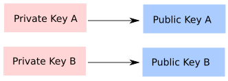
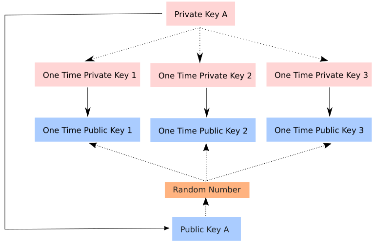

# Abstract
The popularity of cryptocurrencies has been rising exponentially in recent years, however there still lacks a cryptocurrency that is truly decentralized and has the ability scale globally, whilst providing the necessary anonymity for its users. Vanyx aims to combine stealth address, blockchain [1], and blocklattice [2] technologies to overcome the privacy, scaling, spam  and centralization issues.

# 1 Introduction
Bitcoin [1], the first major peer-to-peer cryptocurrency popularized the use of the blockchain data structure to organize and distribute information in a trustless manner between nodes. Since then, blockchain has become the dominant technology used in the core for most alternative cryptocurrencies. It is however unable to scale to accommodate the recent exponential surge in users [3], primarily due to the nature of blockchain. Simply put, a network that utilizes a traditional blockchain must agree on a global state before they can proceed to the next step. This results in poor scalability and high latency. Several proposals have been made to overcome these issues such as SegWit [4] and Lightning Networks [5], but still doesn’t tackle the core of the problem: the need for a global state to be agreed upon by all nodes before proceeding to the next step.

In contrast, blocklattice [2], a novel architecture utilized in the Nano (formerly Raiblocks) cryptocurrency delegates a blockchain to each address (account), allowing “each account-chain to be updated immediately and asynchronously” [6]. The lightweight and asynchronous nature of blocklattice has the potential to scale to a global network of users, making it an ideal candidate as an alternative practical currency. It does however come with several undesirable tradeoffs.

In this paper, we identify and propose solutions to the main deficiencies of the Nano cryptocurrency. We also propose Vanyx - a cryptocurrency that builds upon the shortcomings of Nano, in hopes of being a truly decentralized, practical cryptocurrency.

# 2 Nano Shortcomings 

## 2.1 Spam
Currently, Nano mitigates spam by requiring a lightweight Proof-of-Work calculation to be included in each transaction [6]. However, this does not solve the spamming issue due to Nano’s feeless and instantaneous transaction as anyone can indefinitely send valid transactions through the Nano network, resulting in an unconstrained growth in storage size requirements in running a full node.

Using only USD $3 million worth of hardware and a year’s worth of time, the billion dollar Nano network can be spammed to the point where the storage size requirements exceeds that of not only high-end PCs but also beyond most cloud hosting offerings [7]. 

This severely limits the type of hardware that is capable of running a full node and thereby making it incredibly vulnerable to centralization, which is inherently bad for a peer-to-peer based cryptocurrency.

## 2.2 Lack of Incentive
In order for true decentralization to be reached, a form of incentive must be provided to motivate users to run and maintain nodes in order to protect the network. One popular example would be in Bitcoin, where users compete in finding a nonce for the current block which results in a hash value lower than the target difficulty. The one responsible for finding the correct solution for the current block is awarded a certain amount of Bitcoin in return for their efforts.

Currently in Nano, it is not possible to provide any sort of incentive as this requires a consensus on a global state (e.g. who is rewarded?), due to the stateless nature of blocklattice.

## 2.3 Lack of Anonymity
According to T. Okamoto and K. Ohta, an ideal cryptocurrency has to keep anonymity of their users in mind. In particular "relationship between the user and his purchases must be untraceable by anyone” [9]. The Monero project also outlines two properties that an anonymous cryptocurrency model must satisfy to comply with the above requirements [8]:

Untraceability: for each incoming transaction, all possible senders are equiprobable.
Unlinkability: for any two outgoing transactions, it is impossible to prove they were sent to the same person

As both Nano and Bitcoin share a similar interface, where balances are sent to a public address and a private key is used to sign the transactions with no obscuring. The research done on the privacy and anonymity of Bitcoin transactions can be assumed to be true in Nano. Like Bitcoin, Nano satisfies neither requirements.

Nano doesn’t satisfy the untraceability requirement; as all the transactions are publicly available, any transactions can be traced back to a single source of origin and a final recipient. Additionally, “even if two participants exchange funds in an indirect way, a properly engineered path-finding method will reveal the origin and final recipient” [8].

Nano also doesn’t satisfy the unlinkability requirement - There is also strong evidence that with enough data, a connection between the users of the network and their transactions can be linked ([12], [13], [14]).

## 2.4 Flawed Distribution of Tokens

The distribution of Nano tokens was done manually via a web faucet, supplied by the `faucet account` which was funded in the genesis block [15]. The web faucet overcame spam by incorporating a captcha mechanism before funds could be requested, and to prevent motivated people from draining the faucet using alternative methods, only a limited amount of Nano could be withdrawn from the faucet per hour.

This method of distributing tokens is very centralized and also has single point of failure. It also puts a huge amount of trust on the founding team that they will ensure the distribution of tokens will be done fairly.

# 3 Vanyx Proposal

## 3.1 Reward Chain

As previously mentioned, the stateless nature of blocklattice makes it impossible for all nodes to agree on a global state. The is significant as there can't be a global consensus on which address receives a reward.

As such, Vanyx intents to ultilize both blockchain and blocklattice technologies - the asynchronicity of blocklattice for instant transactions, and a traditional blockchain - which will be referred as the reward chain, to reward users who participant in protecting the network. The reward chain will also be responsible for distributing future 'mined' tokens to the network participants.

To populate the reward chain with rewards, a fee of `0.1%` (capped at 5 NYX) will be taken out of each transaction and inserted into the reward-chain. As the two chains are separate, the reward-chain doesn't affect the transaction speed.

Reward-chain specifications:

1. 5 minute block time
2. 20 NYX rewarded per block on the reward chain, halving every 1 million blocks

Example transaction and reward-chain mining:

1. A has 500 NYX
2. A sends 50 NYX to B
3. Fees = 50 * 0.001 = 0.005 NYX and is included as a field in the transaction.
4. 0.005 NYX is added to the current block in the reward-chain
5. B receives 50 NYX
6. A is left with 449.995 NYX
7. After a period of time, C finds the solution to the current block in the reward-chain, and assuming A -> B is the only transaction that occurred who's fee is added to the solved reward-chain block
8. C is awarded 20.005 NYX

The data structure below depicts a `send` block from `0x0120` to `0x0130`:

```
{
  txid: 0xaaaa,
  previous: 0x0120,  
  balance: 449.995,
  fee: 0.005,
  destination: 0x1234,  
  work: 000,
  type: send,
  signature: 1234
}
```

If the signature is valid, the recipient (`0x0130`) then generates a `receive` block:

```
{
  previous: 0x001,
  source: 0xaaaa,
  work: 000,
  type: receive,
  signature: 4321
}
```

The fees from the `send` block is then added to the current block in the `reward chain`

```
{
  'txid': 0x0120,
  'fee': 0.005
}
```

The reward block is found by `0x00C` with nonce `000123`, `0x00C` is then awarded `20.005 NYX` (20 reward NYX + 0.005 from fees) via Coinbase on the reward-dispute chain.

```
{
  type: coinbase,
  amount: 20.005,
  to: 0x00c,
  signature: abcdef
}
```

The reward-chain not only acts as an incentive to motivate participants to protect the network, it is also an effective way of distributing the tokens, as opposed to an online faucet. Additionally, having mandatory fees per transaction also prevents malicious users from spamming the network indefinitely.

## 3.2 Stealth Addresses

To achieve a satisfactory level of anonymity, Vanyx will build on the Diffie–Hellman key exchange technique described in CryptoNote, commonly referred to as 'Stealth Addresses'. Stealth addresses protect the recipients anonminity by generating a new public key for each transaction. That way all a user needs to do is publish a single public address to achieve unlinkable payments. This design solves the 'address reuse' issue and makes it incredibly tough for any observer to determine if two addresses are linked together.

The following depicts a traditional transation, note how each public key must be associated with a private key:

<center></center>

With a stealth address, it'll enable the receiver to have multiple one public keys whilst only retaining a single private key.

<center></center>

Incorporating stealth addresses increases the storage requirements minimally, whilst still allowing it to be contained within a UDP packet. This makes stealth addresses an ideal candidate for Vanyx as a means for additional privacy.

# 4 Specifications

## 4.1 Technicalities

The proposed proof-of-work hashing algorithm is Ethash from Ethereum [10]. Reason being:

1. ASIC resistant
2. Good documentation and loads of example code
3. Proven to work (RE: Ethereum)

Reward-chain blocktime:

1. 5 minute blocktime
2. 20 NYX reward per block

We are reimplementing Nano's protocol in Elixir, opting for a higher level language like Elixir over C/C++ (what Nano is written in) because of development speed not performance reasons. The code clarity in Elixir allows us to incur much less technical debt, thereby decreasing development time. As we want a system that is capable of handling thousands of small processes simultaneously, concurrency is an important aspect to consider. Luckily, Elxir has been proven to be able to handle that level of traffic [11]. Moreover as Elixir ultilizes the BEAM (Erlang Virtual Machine), one thing it inherits is the ability for hot code reload, potentially allowing nodes to automatically update themselves without interrupting its execution.

## 4.2 Crowdfunding and Token Distribution

There will be a total of `150_000_000` NYX in existence, 30% of which will be distributed during the ICO with a minimum of target of 3.76 million USD and a hardcap of 12.6 million USD. 10% of which will be reserved for future development hires, of which another 10% of which will be used to get exchange listings, whilst 50% of which will be mined throughout its lifetime.

The ICO will be done on Ethereum as an ERC-20 token, and be merged back into Vanyx (via a snapshot) once the mainnet is released.

The ICO will be held in 4 rounds:
- 1st round: (private) 57k USD minimum, with a 20% bonus
- 2nd round: 5k USD maximum, 10% bonus
- 3rd round: 2.5k USD maximum, 5% bonus
- 4th round: 1k USD maximum, no bonus

## 4.3 Crowdfunding Breakdown

Min target: 3_760_000 USD

The table below depicts our ideal hiring positions:

| Job Title | Salary Range (USD) | Position(s) | Approx Cost (USD / year) |
| --- | ------------ | ------------- | -----------: |
| Graphics Designer | 55k - 75k | 1 | 125k |
| Community Manager | 55k - 75k | 2 | 250k |
| Software Engineer | 75k - 120k | ~10 | 1mil |
|  |  | Total (approx) | 1.325 mil |

Whereas the table below depicts the allocation for business expenditures for the entire team:

| Expenditure | Allocation (USD / year) |
| --- | -----------: |
| Conferences | 53k |
| Accomodation & travel | 63k |
| Total | 116k |

This brings the total expenditure to around 1.441 million USD / year. We believe this is reasonable as we are looking to build an engineering heavy team. The budget allows a minimum runway of 2 years to provide them with minimum job security and a decent salary in order to attract the best talent to enable us to build the best product. The graphics designer is to illustrate technical concepts in a easy to digest format (such as an infograph) for the general public. This will help to attract interest and grows the community. The rest of the funds is then used to cover legal fees.

Should we receive funding beyond our minimum target, we will be hiring more engineers to help reduce development time, write documentation, and tools to help integrate Vanyx as a developer friendly alternative on par with Stripe. We'll also be hiring more community managers and country representative to help with the adoption of Vanyx as the digital payment solution of today and the future.

## 4.4 Proposed Timeline

Q2 2018
- Initial whitepaper release
- Functioning website
- Online forum / Reddit
- Telegram group

Q3/4 2018:
- PreFund round
- ICO
  - Do KYC

Q1 2019:

- Scout/recruit potential team members
- Begin development of
    - Vanyx Core
    - SPV light wallet
    - Web-based block explorer
    - CI/CD DevOps server
    - Documentation

Q1 2019 - Q4 2019:

- Attend conferences and give talks about the development process
  of Vanyx and the internal workings
- Spread Awareness on Vanyx
- Continue working on Vanyx core
- Have biweekly updates with community

Q4 2019:

- Vanyx testnet release
- Open alpha/beta testnet launched to public
- Iteratively fix and update core according to bug reports
- SPV Wallet beta release
- Block explorer beta release

Q1 2020:

- Vanyx mainnet release
- Public release
- Get onto exchanges

Q1 2020 ONWARDS:

- Iterate through community feedback


# 5 Conclusion

The goal of Vanyx is not to reinvent the wheel, but rather combine proven and working technologies into one cohesive project. In Vanyx' case, we would like to be the first alternative cryptocurrency that enables fast and instant transactions whilst putting the user's privacy at mind.

We're confident that by using Elixir, the Vanyx project can progress swiftly and securely.

# 6 Team

Kendrick Tan

Kendrick was previously a member of the ZENCash foundation and who has written parts of the core tools and libraries for ZENCash. He has experience in blockchain protocol development, fullstack, machine learning and is passionate in functional programming. He is also a TechStar alumni.

Nikita Andrews

Nikita has over 8 years of online advertising experience. Prior to this, he ran his own performance advertising consultancy in Hong Kong. Previously, he worked for AdTech startups out of Toronto, San Franciso, New York, and London. B.A.Sc. Industrial Engineering (Operations Research), University of Toronto.

Josh Ma

Josh has consulted as a software engineer on client engagements at IBM Canada for over 2 years and has been a crypto enthusiast/developer since early 2016. Currently completing his law degree, Josh obtained a B.A.Sc. in Mechanical Engineering at the University of Toronto.

Desiree Vogt-Lee

Desiree is currently studying physics at UQ and is passionate in quantum computing. In her day job, she is currently working in the field of data and machine learning.

Adrian Li

Adrian is a technical consultant and developer that has worked for several Y-Combinator and Techstars companies. He has years of experience in engineering full stack solutions and strategies for high velocity startups. In his spare time, Adrian enjoys participating in the open-source community.

# References

[1] Bitcoin: A Peer-to-Peer Electronic Cash System. [online] Available: https://bitcoin.org/bitcoin.pdf

[2] Blocklattice. [online] Available: https://github.com/nanocurrency/raiblocks/wiki/Block-lattice

[3] Bitcoin is Now Useless for Micropayments, But Solutions are Coming. [online] Available: https://www.nasdaq.com/article/bitcoin-is-now-useless-for-micropayments-but-solutions-are-coming-cm760684

[4] Will 2017 Bring an End to Bitcoin’s Great Scaling Debate? [online] Available: http://www.coindesk.com/2016-bitcoin-protocol-block-size-debate/

[5] The Bitcoin Lightning Network [online] Available: https://lightning.network/lightning-network-summary.pdf

[6] RaiBlocks: A Feeless Distributed Cryptocurrency Network [online] Available: https://raiblocks.net/media/RaiBlocks_Whitepaper__English.pdf

[7] It seems to only cost $3m to centralize Nano (RaiBlocks). [online] Available: https://web.archive.org/web/20180201203544/https://medium.com/@qertoip/it-seems-to-only-cost-3m-to-kill-nano-raiblocks-37d78a4e96ca

[8] CryptoNote v 2.0 [online] Available: https://github.com/monero-project/research-lab/blob/2d752337bb284384ea39bd78902f9ce67ab658a1/whitepaper/whitepaper.pdf

[9] Ethereum Whitepaper. [online] Available:
https://web.archive.org/web/20180307035553/https://github.com/ethereum/wiki/wiki/White-Paper#bitcoin-as-a-state-transition-system

[10] Ethhash. [online] Available: https://github.com/ethereum/wiki/wiki/Ethash

[11] How Discord Scaled Elixir to 5,000,000 concurrent users. [online] Available: https://blog.discordapp.com/scaling-elixir-f9b8e1e7c29b

[12] Marc Santamaria Ortega. The bitcoin transaction graph - anonymity. Master’s thesis, Universitat Overta de Catalunya, June 2013

[13] Fergal Reid and Martin Harrigan. An analysis of anonymity in the bitcoin system. CoRR, abs/1107.4524, 2011.

[14] Dorit Ron and Adi Shamir, Quantitative analysis of the full bitcoin transaction graph. IACR Cryptology ePrint Archive, 2012:584, 2012

[15] Distribution, Mining and Units. [online] Available: https://github.com/nanocurrency/raiblocks/wiki/Distribution,-Mining-and-Units
